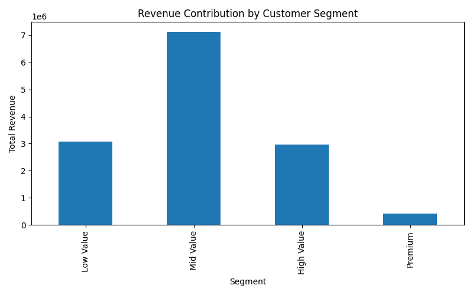
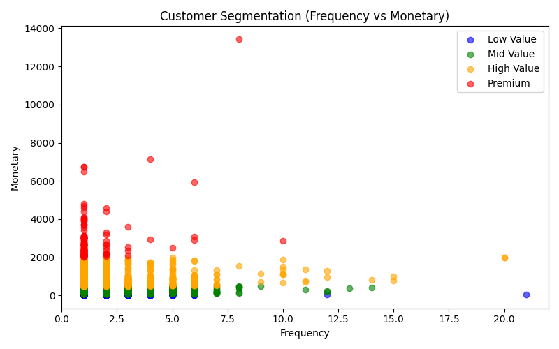
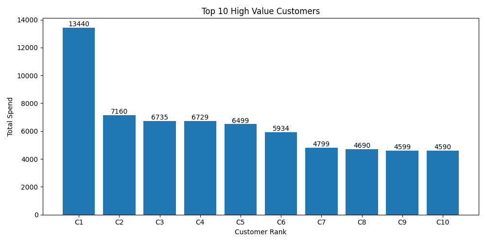

# Customer Segmentation using RFM Analysis

This project performs customer segmentation using RFM (Recency, Frequency, Monetary) analysis on a real-world e-commerce dataset.

## Objective
To segment customers based on purchasing behavior and identify high-value customers for targeted marketing.

## Dataset
Olist E-commerce Dataset (100K+ records)

## Tools Used
- Python
- Pandas
- Matplotlib

## Analysis Performed
- Calculated Recency, Frequency, and Monetary values for each customer
- Segmented customers into Low, Mid, High, and Premium groups
- Analyzed revenue contribution by customer segments
- Identified high-value customers and purchasing patterns

## Key Insights
- Mid-value customers contributed the highest total revenue
- Premium customers showed high individual spending
- Customer segmentation helps improve retention and marketing strategies

## Visualizations

### Revenue Contribution by Segment


### Customer Segmentation (Scatter Plot)


### Top 10 High Value Customers


## How to Run
```bash
pip install pandas matplotlib
python customer_segmentation.py
```

## Author
Charan  
Aspiring Data Analyst
